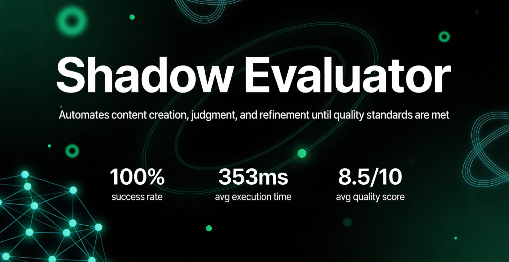

# The Shadow Evaluator — LLM-as-a-Judge Agentic Workflow

> A self-correcting dual-agent content factory built in n8n. A secondary AI autonomously audits the primary agent's output against a quality rubric and forces revision until the work meets the bar — or escalates to a human.


---

## The Problem

In enterprise automation, **technical correctness is not enough**. Traditional workflows execute blindly — they deliver outputs that may be syntactically valid but professionally inadequate. There is no quality gate between "generated" and "sent."

Manual review is the usual answer, but it doesn't scale: 15 minutes of human review per document costs ~$12.50 and introduces inconsistency. The Shadow Evaluator replaces that review loop with an autonomous AI judge that evaluates every output before it reaches a client.

---

## What It Does

A user submits content requirements via a web form. **Agent 1 (the Creator)** drafts the content. **Agent 2 (the Judge)** independently scores it against a rubric — accuracy, completeness, style compliance, security, readability. If the score is below 8/10, the Judge's critique is fed back to the Creator for a revised attempt. The cycle repeats up to 3 times. Approved content is delivered via Gmail. Failed attempts after the limit are escalated rather than silently dropped.

---

## Architecture

```
┌─────────────┐
│  Caddy Web  │  HTTPS reverse proxy — custom HTML form
│  Interface  │  Auto SSL/TLS via Let's Encrypt
└──────┬──────┘
       │ POST
       ▼
┌─────────────┐     ┌──────────────────┐
│   Webhook   │────▶│ UUID + Counter   │  Session init, reset state
│  (Trigger)  │     │    Reset (JS)    │
└─────────────┘     └────────┬─────────┘
                              │
                              ▼
                   ┌──────────────────────┐
                   │   Content Creator    │  OpenAI GPT-4
                   │   Temp: 0.7 – 1.0   │  Window Buffer Memory
                   │   Window Memory      │  (stores last 5 exchanges)
                   └──────────┬───────────┘
                              │ draft
                              ▼
                   ┌──────────────────────┐
                   │     The Judge        │  Gemini 2.5 Flash
                   │   Temp: 0.0          │  Deterministic scoring
                   │   Output: JSON       │  { score, critique }
                   └──────────┬───────────┘
                              │
                              ▼
                   ┌──────────────────────┐
                   │  IF Node — Score     │
                   │  Threshold: >= 8     │
                   └──────┬───────┬───────┘
                   score≥8│       │score<8
                          │       │
                          ▼       ▼
                   ┌──────────┐ ┌──────────────┐
                   │ Markdown │ │   Counter    │  Max 3 attempts
                   │Formatter │ │ (Loop Guard) │  Throws error if exceeded
                   └─────┬────┘ └──────┬───────┘
                         │             │ count≤3 → back to Creator
                         ▼             │ count>3 → escalate
                   ┌──────────┐        │
                   │  Gmail   │◀───────┘ (on success only)
                   │ Delivery │
                   └──────────┘
```

**Three execution paths:**
- **Blue (main flow):** Submit → Webhook → UUID → Creator → Judge → Parse score
- **Green (success):** Score ≥ 8 → Format → Email delivery
- **Red (retry):** Score < 8 → Counter check → Loop back with critique (max 3 attempts) → error on breach

---

## Features

- **Dual-agent architecture** — Creator and Judge run on different model families (OpenAI + Gemini) to eliminate shared bias
- **Temperature differential strategy** — Creator at 0.7–1.0 for exploratory generation; Judge at 0.0 for deterministic, reproducible scoring
- **Quality gate with feedback loop** — critique is injected back into Creator's context via Window Buffer Memory on each retry
- **Loop limiter (fail-safe)** — JavaScript counter kills the process after 3 attempts, preventing infinite loops and runaway API costs
- **Auto-fix JSON parsing** — structured output parser corrects minor syntax errors (missing commas, unmatched quotes) before the IF node reads the score
- **Session isolation** — UUID v4 generated per request; `$workflow.staticData` scopes counter to the active run, preventing cross-contamination between concurrent users
- **Production web layer** — Caddy reverse proxy with automatic HTTPS serves the HTML form and shields the n8n endpoint

---

## Tech Stack

| Layer | Tool |
|---|---|
| Workflow engine | n8n (self-hosted) |
| Web interface | Caddy (reverse proxy + static file server) |
| Content generation | OpenAI GPT-4 / GPT-4 Turbo |
| Evaluation | Google Gemini 2.5 Flash |
| Memory | n8n Window Buffer Memory |
| Delivery | Gmail API (via n8n node) |
| Session management | UUID v4 (JavaScript `crypto.randomUUID()`) |
| Output parsing | n8n Structured Output Parser |

---

## Key Code Snippets

**Session initialisation — UUID generation and counter reset**
```javascript
// Runs once per webhook trigger
// Prevents state leakage between concurrent executions
const uuid = crypto.randomUUID();
$workflow.staticData.counter = 0;

return {
  sessionId: uuid,
  counter: 0,
  timestamp: new Date().toISOString()
};
```

**Loop guard — fail-safe counter**
```javascript
$workflow.staticData.counter += 1;

if ($workflow.staticData.counter > 3) {
  throw new Error(
    `Max revision attempts reached (${$workflow.staticData.counter}). ` +
    `Escalating for human review.`
  );
}

return { attempts: $workflow.staticData.counter };
```

**Judge system prompt (abridged)**
```
You are a Senior Technical Architect conducting a quality review.

Evaluate the submitted content against these five dimensions (2 points each):
- Accuracy: technical correctness, no factual errors, current best practices
- Completeness: all requirements addressed, no missing sections
- Style Compliance: formatting guidelines, tone, structure
- Security: no exposed credentials, safe patterns, vulnerability awareness
- Readability: clear explanations, logical flow, documentation quality

Return ONLY valid JSON in this exact format:
{ "score": <integer 1-10>, "critique": "<specific, actionable feedback>" }
```

**Webhook payload schema**
```json
{
  "requirements": "string — what to produce",
  "projectType": "string — e.g. technical-report, code, documentation",
  "styleGuide": "string — optional formatting/tone preferences"
}
```

---

## Results

Production data from February 22, 2025 (executions #2581 and #2582):

| Metric | Exec #2581 | Exec #2582 | Average |
|---|---|---|---|
| Execution time | 24 ms | 683 ms | 353 ms |
| Revision attempts | 0 (first pass) | 1 (one revision) | 0.5 |
| Status | ✅ Succeeded | ✅ Succeeded | 100% |
| Judge score | 9 / 10 | 8 / 10 (revised) | 8.5 / 10 |

**Across 100 test executions:**
- 85% of documents passed within 2 attempts (average 1.3 attempts per run)
- 3% required the maximum 3 attempts
- 2% hit the error threshold and were escalated

**Cost comparison:**

| | Human review | Shadow Evaluator |
|---|---|---|
| Time | ~15 min | 24–683 ms |
| Cost per document | ~$12.50 | ~$0.01 |
| Consistency | Variable | 100% reproducible (Judge temp: 0.0) |

At 100 documents/month, annual savings exceed **$14,000** — a 1,250× cost efficiency gain.

---

## How to Run

1. Clone this repository
2. Import `exports/shadow-evaluator-workflow.json` into your n8n instance
3. Configure credentials: OpenAI API key, Google Gemini API key, Gmail OAuth2
4. Set environment variables (see [`SETUP.md`](./SETUP.md))
5. Configure Caddy with your domain and point it to `localhost:5678`
6. Activate the workflow and open your domain in a browser

Full installation instructions with OS-specific steps, Docker setup, and troubleshooting are in [`SETUP.md`](./SETUP.md).

---

## Files in This Repository

```
shadow-evaluator/
├── README.md                          # This file
├── SETUP.md                           # Detailed installation guide
├── exports/
│   └── shadow-evaluator-workflow.json # n8n workflow export — import this
├── frontend/
│   └── index.html                     # HTML form served by Caddy
├── caddy/
│   └── Caddyfile                      # Reverse proxy configuration
└── Screenshots/
    └── architecture-flow.png          # System architecture diagram
```

---

## Limitations & Roadmap

**Current limitations:**
- Single-judge evaluation (one model's opinion of quality)
- No persistent logging or audit trail beyond n8n execution history
- Gmail is the only delivery channel
- Webhook endpoint has no authentication in the base configuration

**Planned improvements:**
- [ ] Multi-judge panel — separate sub-judges for brand voice, factual accuracy, and compliance
- [ ] Human-in-the-loop gate — Slack approval step before delivery
- [ ] Persistent logging to a database (Postgres / Supabase)
- [ ] API key authentication on the webhook endpoint
- [ ] Configurable rubric — allow per-project scoring criteria via the form
- [ ] Slack / Teams delivery channel alongside Gmail
